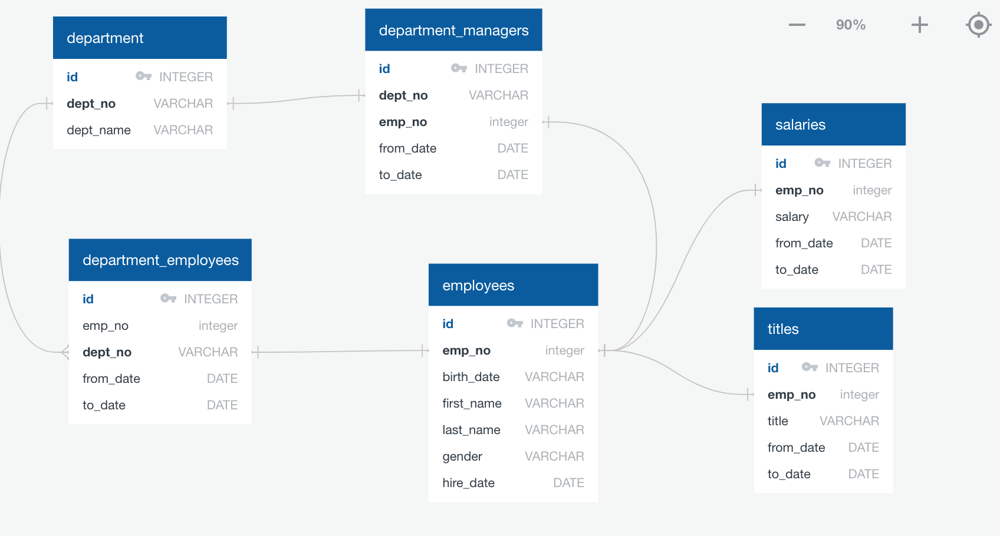

# SQL Challenge - Employee Database

## Background

It is a beautiful spring day, and it is two weeks since you have been hired as a new data engineer at Pewlett Hackard. Your first major task is a research project on employees of the corporation from the 1980s and 1990s. All that remain of the database of employees from that period are six CSV files.

In this challenge, the following will be performed:

1. Data Modeling - design the tables to hold data in the CSVs

2. Data Engineering - import the CSVs into a SQL database

3. Data Analysis - answer questions about the data

#### Data Modeling

Inspect the CSVs and sketch out an [ERD](SQLfiles/ERD.png) of the tables.

#### Data Engineering

* Use the information to create a [table schema](SQLfiles/table_schemata.sql) for each of the six CSV files. 

* Import each CSV file into the corresponding SQL table.

#### Data Analysis

Complete the following analysis:

1. List the following details of each employee: employee number, last name, first name, gender, and salary.

2. List employees who were hired in 1986.

3. List the manager of each department with the following information: department number, department name, the manager's employee number, last name, first name, and start and end employment dates.

4. List the department of each employee with the following information: employee number, last name, first name, and department name.

5. List all employees whose first name is "Hercules" and last names begin with "B."

6. List all employees in the Sales department, including their employee number, last name, first name, and department name.

7. List all employees in the Sales and Development departments, including their employee number, last name, first name, and department name.

8. In descending order, list the frequency count of employee last names, i.e., how many employees share each last name.

#### *This README was modified from the original obtained through Trilogy Education Services © 2019. All Rights Reserved.